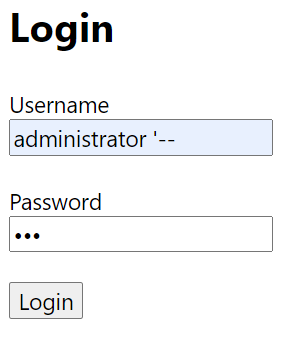
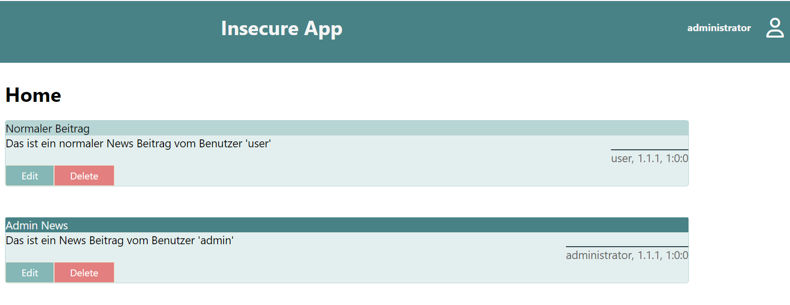
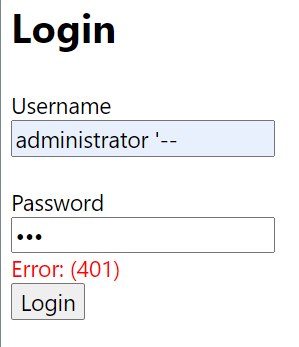
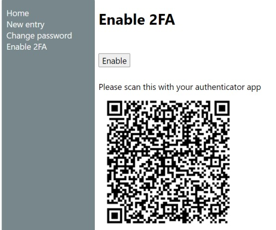
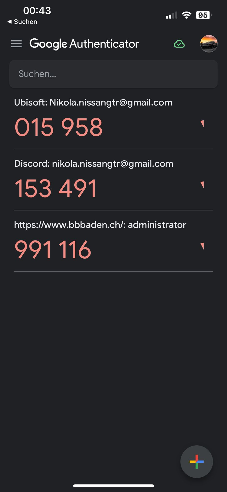
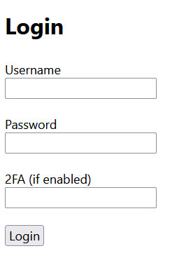

# Applikationssicherheit

## Einleitung

Dieses Portfolio präsentiert einen umfassenden Einblick in die Entwicklung und Implementierung von sicheren Web-Applikationen. Der Fokus liegt darauf, das Bewusstsein und Wissen über Cybersecurity zu erweitern, basierend auf den Erkenntnissen aus dem Modul 183 Applikationssicherheit implementieren. Ich gehen auf aktuelle, kritische Bedrohungen ein und erläutern anhand von Beispielen, wie Sicherheitslücken, insbesondere solche durch Injection, effektiv erkannt und behoben werden können. Die Bedeutung robuster Authentifizierungs- und Autorisierungsmechanismen. Zudem integriere ich Sicherheitsaspekte in den Software-Lebenszyklus und diskutieren die Vorteile defensiven Programmierens. Abschließend wird die Wichtigkeit effektiver Auditing- und Logging-Verfahren beleuchtet, um die Applikationssicherheit kontinuierlich zu verbessern und zu gewährleisten.

## Aktuelle Bedrohungen

Im Rahmen dieses Handlungsziels konzentriere ich mich auf die Identifikation und Analyse aktueller Bedrohungen im Bereich der Webanwendungen sowie die Erarbeitung von Abwehrstrategien. Grundlage hierfür sind die umfangreichen und frei zugänglichen Ressourcen des Open Web Application Security Project (OWASP), insbesondere die [OWASP Top 10](https://owasp.org/www-project-top-ten/#), welche die vorherrschenden Sicherheitsrisiken aufzeigt

**Broken Acces Control**

Was sind Broken Acces Controls? Es bestimmt Zugriffskontrollen, auf welche Funktionen und Daten Benutzer innerhalb einer Anwendung zugreifen dürfen. Wenn diese Kontrollen gebrochen sind, können unautorisierte Benutzer auf Daten oder Funktionen zugreifen, die für sie gesperrt sein sollten.
Dies kann passieren, wenn Anwendungen die Zugriffssteuerungen nicht konsequent durchsetzen, oder wenn Entwickler nicht vorsehen, wie ihre Systeme umgangen werden könnten. 

Gegenmassnahmen

* Implementierung eines Default-Deny-Systems
* Zugriffssteuerungsprüfungen sollten auf Serverseite durchgeführt werden

**Cryptographic Failures**

Was sind Cryptographic Failures? Bezieht sich auf Sicherheitsanfälligkeiten, die dazu führen, dass sensible Daten ungeschützt sind, oft aufgrund von Fehlern in der Kryptografie.
Kryptographische Fehler können durch schwache Verschlüsselungsalgorithmen, unsachgemäße Implementierung, schlecht verwaltete Schlüssel oder das Fehlen einer Verschlüsselung für sensible Daten auftreten.

Gegenmassnahmen

* Verwendung von starken Verschlüsselungsstandards unteranderem eine authentifizierte Verschlüsselung.
* Vermeidung von veraltete kryptografische Funktionen. 

**Injection**

Was sind Injections? Injection-Angriffe, wie SQL oder NoSQL Injection, treten auf, wenn unvertrauenswürdige Daten als Teil eines Befehls oder einer Abfrage gesendet werden, was zu unbefugten Datenzugriffen oder dem Verlust von Daten führen kann. Sie treten auf, wenn Eingabedaten nicht richtig validiert oder gesäubert werden, und ein Angreifer kann bösartigen Code in die Anwendung einschleusen, der vom Server als legitimer Befehl ausgeführt wird.

Gegenmassnahmen

* Die Verwendung einer sicheren API, welche die Verwendung von Interpreter vollständig vermeidet. 
* Verwenden Sie LIMIT und andere SQL-Steuerelemente innerhalb von Abfragen.

**Insecure Design**

Was sind Isecure Designs? Ein unsicheres Design bezieht sich auf Sicherheitsrisiken, die aus Entscheidungen resultieren, die während des Designprozesses einer Anwendung getroffen werden. Dieses Risiko entsteht, wenn Sicherheit nicht als integraler Bestandteil des Entwurfsprozesses angesehen wird, was zu Systemen führt, die anfällig für Angriffe sind, da sie keine angemessenen Schutzmaßnahmen bieten.

Gegenmassnahmen

* Die Integration einer Sicherheitssprache in User Stories. 
* Nutzen der Bedrohungsmodellierung für kritische Authentifizierung, Zugriffskontrolle, Geschäftslogik und Schlüsselabläufe.

**Verifizierung**

sddsd.

**Beurteilung der Umsetzung**

sdsdsd.

## Sicherheitslücken und ihre Ursachen

In der Insecure App gibt es eine Sicherheitslücke bei der Verarbeitung der Logindaten. Man kann sich in der App mithilfe der SQL Injection als Administrator ausgeben ohne das nötige Passwort zu wissen und sich somit einloggen. Mit den Eingaben aus dem folgendem Bild kann man sich als Administrator einloggen. 

Und im zweiten Bild, sieht man jetzt wie man als Administrator eingeloggt ist.

Um diese SQL Injection zu verhindern, müssen wir diesen Code hier verändern. 

        [HttpPost]
        [ProducesResponseType(200)]
        [ProducesResponseType(400)]
        [ProducesResponseType(401)]
        public ActionResult<User> Login(LoginDto request)
        {
            if (request == null || request.Username.IsNullOrEmpty() || request.Password.IsNullOrEmpty())
            {
                return BadRequest();
            }

            string sql = string.Format("SELECT * FROM Users WHERE username = '{0}' AND password = '{1}'", 
                request.Username, 
                MD5Helper.ComputeMD5Hash(request.Password));

            User? user= _context.Users.FromSqlRaw(sql).FirstOrDefault();
            if (user == null)
            {
                return Unauthorized("login failed");
            }
            return Ok(user);
        }

Die gefolgte Gegenmassnahme.

        [HttpPost]
        [ProducesResponseType(200)]
        [ProducesResponseType(400)]
        [ProducesResponseType(401)]
        public ActionResult<User> Login(LoginDto request)
        {
            if (request == null || request.Username.IsNullOrEmpty() || request.Password.IsNullOrEmpty())
            {
                return BadRequest();
            }

            string username = request.Username;
            string passwordHash = MD5Helper.ComputeMD5Hash(request.Password);

            User? user = _context.Users
                .Where(u => u.Username == username)
                .Where(u => u.Password == passwordHash)
                .FirstOrDefault();

            if (user == null)
            {
                return Unauthorized("login failed");
            }
            return Ok(user);
        }

Hier wurde das Problem behoben. Es können keine SQL Injections mehr eingeführt werden, da die Benutzereingabe nicht direjt in die SQL-Abrage eingefügt wird. Hier verwendet man die ".Where()" Methode welche die LINQ-Abfrage verwendet. 

Im folgenden Bild sieht man, dass nach der Behebung der Sicherheitslücke man keine SQL Injections mehr anwenden kann.

**Verifizierung**

sddsd.

**Beurteilung der Umsetzung**

sdsdsd.

## Mechanismen für die Authentifizierung und Autorisierung

**Was ist eine Authentifizierung**

Authentifizierung ist ein Sicherheitsprozess, der die Identität einer Person oder eines Systems bestätigt. Dies geschieht durch Überprüfung von Berechtigungsnachweisen, wie z.B. einem Passwort, einem Sicherheitstoken oder biometrischen Daten. Ziel ist es zu gewährleisten, dass Nutzer wirklich die sind, die sie vorgeben zu sein, bevor sie Zugang zu einem geschützten System erhalten. Authentifizierung schützt vor unbefugtem Zugriff und ist ein grundlegender Bestandteil der digitalen Sicherheit in der Informationstechnologie.

**Implementation**

In der Insecure App geht es weiter mit der Authetifizierung. Vorhin hatten wir einen Fehler behoben bei der Authentifizierung. Jetzt geht es einen Schritt weiter. Anstatt das wir uns jetzt nur noch mit einem Benutzernamen und Passwort anmelden, verwenden wir eine 2-Faktor-Authentifizierung basierend auf der Google-Authenticator App. Jetzt kann man sich nicht mehr alleine mit dem Passwort anmelden, man benötigt dafür die App. In der App wird ein 6-stelliger Code generiert welchen man dann eingeben muss. 

Damit die 2-Faktor-Authentifizierung genutzt werden kann, muss man auf "Enable 2FA" klicken, nachdem erhält man einen QR-Code welcher innerhalb der App gescannt werden muss. Nach dem Scannen befindet sich das Konto in der App und ein Code wird von nun an dort erstellt. 

So sieht es in der Google-Authenticator App aus. 

Jetzt kann man den Code aus der App nehmen und diesen in dem "2FA" Feld eingeben. 

So sieht der Code aus für diese Funktion. 

Diesen Code Abschnitt fügt man in der Klasse LoginController ein. 

        if (user.SecretKey2FA != null)
        {
            string secretKey = user.SecretKey2FA;
            string userUniqueKey = user.Username + secretKey;
            TwoFactorAuthenticator authenticator = new TwoFactorAuthenticator();
            bool isAuthenticated = authenticator.ValidateTwoFactorPIN(userUniqueKey, request.UserKey);
            if (!isAuthenticated)
            {
                return Unauthorized("login failed");
            }
        }

            return Ok(CreateToken(user));

Diesen Code Abschnitt fügt man in der Klasse AuthController ein. 

        public ActionResult<Auth2FADto> Enable2FA()
        {
            var user = _context.Users.Find(_userService.GetUserId());
            if (user == null)
            {
                return NotFound(string.Format("User {0} not found", _userService.GetUsername()));
            }
            {
                var secretKey = Guid.NewGuid().ToString().Replace("-", "").Substring(0, 10);
                string userUniqueKey = user.Username + secretKey;
                string issuer = _configuration.GetSection("Jwt:Issuer").Value!;
                TwoFactorAuthenticator authenticator = new TwoFactorAuthenticator();
                SetupCode setupInfo = authenticator.GenerateSetupCode(issuer, user.Username, userUniqueKey, false, 3);

                user.SecretKey2FA = secretKey;
                _context.Update(user);
                _context.SaveChanges();

                Auth2FADto auth2FADto = new Auth2FADto();
                auth2FADto.QrCodeSetupImageUrl = setupInfo.QrCodeSetupImageUrl;

                return Ok(auth2FADto);
            }
        }

**Was ist eine Autorisierung**

Autorisierung ist der Prozess, bei dem entschieden wird, ob ein bereits authentifizierter Benutzer Zugriff auf bestimmte Ressourcen oder die Erlaubnis zur Ausführung bestimmter Aktionen erhält. Die Autorisierung dient dazu, sicherzustellen, dass Benutzer nur die für ihre Rolle oder Zuständigkeit erforderlichen Berechtigungen erhalten, um so das Risiko eines unbefugten Zugriffs oder Missbrauchs von Daten und Funktionen zu minimieren.

**Implementation**

In der Insecure App hat man zwei Rollen, einmal den Administrator und Nutzer. Beide Autoren haben die Möglichkeit Veränderungen in der App vorzunehmen. Hier wird geprüft oder der Autor entweder ein Autor oder Nutzer ist und erhält somit die Erlaubnis einen EIntrag zu verändern. Wenn die IDs des Autoren nicht übereinstimmen erhält er keinen Zugriff die Aktion auszuführen. 

        [HttpPatch("{id}")]
        [ProducesResponseType(200)]
        [ProducesResponseType(403)]
        [ProducesResponseType(404)]
        public ActionResult Update(int id, NewsWriteDto request)
        {
            if (request == null)
            {
                return BadRequest();
            }

            var news = _context.News.Find(id);
            if (news == null)
            {
                return NotFound(string.Format("News {0} not found", id));
            }

            if (!_userService.IsAdmin() && _userService.GetUserId() != news.AuthorId)
            {
                return Forbid();
            }

            news.Header = HttpUtility.HtmlEncode(request.Header);
            news.Detail = HttpUtility.HtmlEncode(request.Detail);
            news.AuthorId = _userService.GetUserId();
            news.IsAdminNews = _userService.IsAdmin();

            _context.News.Update(news);
            _context.SaveChanges();

            return Ok();
        }

**Verifizierung**

sddsd.

**Beurteilung der Umsetzung**

sdsdsd.

## Sicherheitsaspekte bei der Systementwicklung

ss

**Verifizierung**

sddsd.

**Beurteilung der Umsetzung**

sdsdsd.

## Auditing und Logging: Schlüsselstrategien für Auswertungen und Alarme

xx

**Verifizierung**

sddsd.

**Beurteilung der Umsetzung**

sdsdsd.

## Selbsteinsschätzung

ddd
